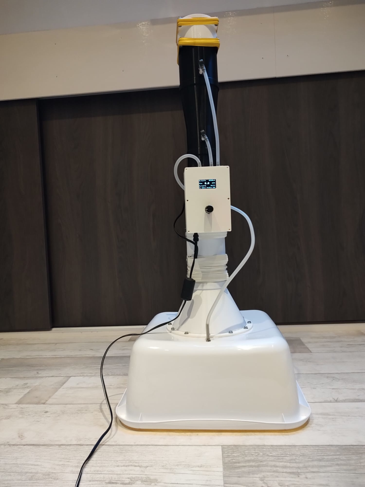
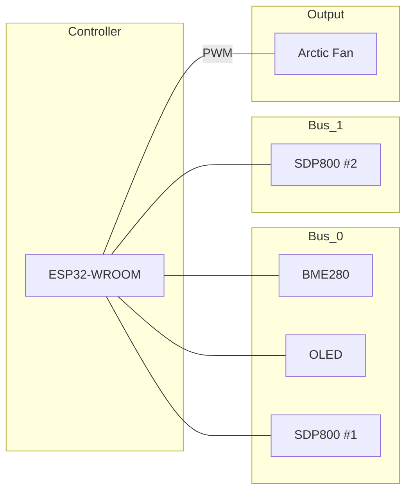

# 3D-printed Venturi Flow Meter

<p align="left">
  
</p>


# Zero-Pressure Compensated Airflow Meter & Calibration Rig
This project provides an open-source, high-precision solution for measuring air flow in ventilation systems (such as HRV/MVHR units). For approximately €100, you can build an instrument that rivals the accuracy of professional meters costing thousands of euros.

# 1. Project Overview
The system consists of two configurations running on the same ESP32 architecture:

The Flow Meter (DUT): Uses an active compensation fan to eliminate its own flow resistance (zero-pressure measurement).

The Test Rig (Reference): A modular 125mm wind tunnel featuring a calibrated Venturi section for reference measurements.

---

# Nuldruk-gecompenseerde Luchtdebietmeter & Testbank

Dit project biedt een open-source, high-precision oplossing voor het meten van luchtdebiet in ventilatiesystemen (zoals WTW-units). Voor circa **€100,-** bouwt u een instrument dat qua nauwkeurigheid concurreert met professionele meters van duizenden euro's.

## 1. Project Overzicht

Het systeem bestaat uit twee delen die op dezelfde ESP32-basis draaien:

* **De Debietmeter:** Gebruikt een actieve compensatie-ventilator om de eigen weerstand te elimineren (nuldruk-meting).
* **De Testbank:** Een modulaire 125mm windtunnel met een gekalibreerde Venturi-sectie voor referentiemetingen.

---

## 2. Hardware Architectuur (ESP32-WROOM)

De schakeling gebruikt twee gescheiden I2C-bussen om adres-conflicten tussen de identieke SDP800 sensoren te voorkomen.

### Pinbezetting (Pinout)

| Component | Functie | ESP32 GPIO | Opmerking |
| --- | --- | --- | --- |
| **I2C Bus 0** | SDA / SCL | **21 / 22** | BME280, OLED, SDP800 #1 (Referentie) |
| **I2C Bus 1** | SDA / SCL | **25 / 26** | SDP800 #2 (Nuldruk sensor) |
| **Encoder** | CLK / DT / SW | **2, 4, 15** | Bediening menu en kalibratie |
| **PWM Fan** | Control | **27** | 25kHz PWM signaal naar Arctic Fan |



---

## 3. Mechanische Opbouw (3D-Print)

### De Testbank (Referentie)

De testbank is opgebouwd uit modulaire 125mm secties:

1. **Inlaat:** 500x500mm paneel met Ø125mm ventiel-interface.
2. **Conditionering:** Dubbele honingraat-gelijkrichters voor een laminair flowprofiel.
3. **Meetkern:** Venturi-buis (, ).
4. **Aandrijving:** Arctic S12038-8K server-ventilator (12V).

---

## 4. Rekenmethodiek & Compensatie

De nauwkeurigheid van dit systeem komt voort uit real-time compensatie van de luchtdichtheid ($$\rho$$). We gebruiken de **Magnus-Tetens benadering** voor de invloed van luchtvochtigheid.

### Luchtdichtheid ($$\rho$$)

De dichtheid wordt berekend door de partiële drukken van droge lucht en waterdamp op te tellen:

$$\rho = \frac{p_{dry}}{R_d \cdot T} + \frac{p_{vapor}}{R_v \cdot T}$$


### Volumestroom ($$Q$$)

Het debiet door de Venturi wordt berekend via:

$$Q = 3600 \cdot C_d \cdot A_{throat} \cdot \sqrt{\frac{2 \cdot \Delta P}{\rho \cdot (1 - \beta^4)}}$$

Waarin Beta ($$\beta$$) gelijk is aan:

$$\beta = \frac{D_{throat}}{D_{inlet}}$$
 
---

## 5. Installatie & Gebruik

### Software Configuratie

Zorg dat de `Wire` bussen correct worden geïnitialiseerd in de Arduino IDE:

```cpp
TwoWire I2C_0 = TwoWire(0);
TwoWire I2C_1 = TwoWire(1);

void setup() {
  I2C_0.begin(21, 22); // Hoofdbus
  I2C_1.begin(25, 26); // Secundaire bus voor nuldruk
}

```

### Voeding

* **Debietmeter:** 12V 2A adapter.
* **Testbank:** 12V 5A adapter (vanwege de krachtige S12038 ventilator).
* Gebruik een kwalitatieve 12V->5V step-down converter voor de ESP32.

---

## 6. Kalibratie

1. **Luchtdichtheid:** Controleer of de BME280 de juiste omgevingswaarden geeft.
2. **Nul-meting:** Kalibreer de SDP800 sensoren bij stilstaande lucht.
3. **K-factor:** Gebruik de testbank om de *Discharge Coefficient* ($$C_d$$) van uw specifieke 3D-print te bepalen (startwaarde: 0.975).

---

## Licentie

Dit project is gelicenseerd onder de **MIT-licentie**. Voel u vrij om het te verbeteren en te delen!

---
