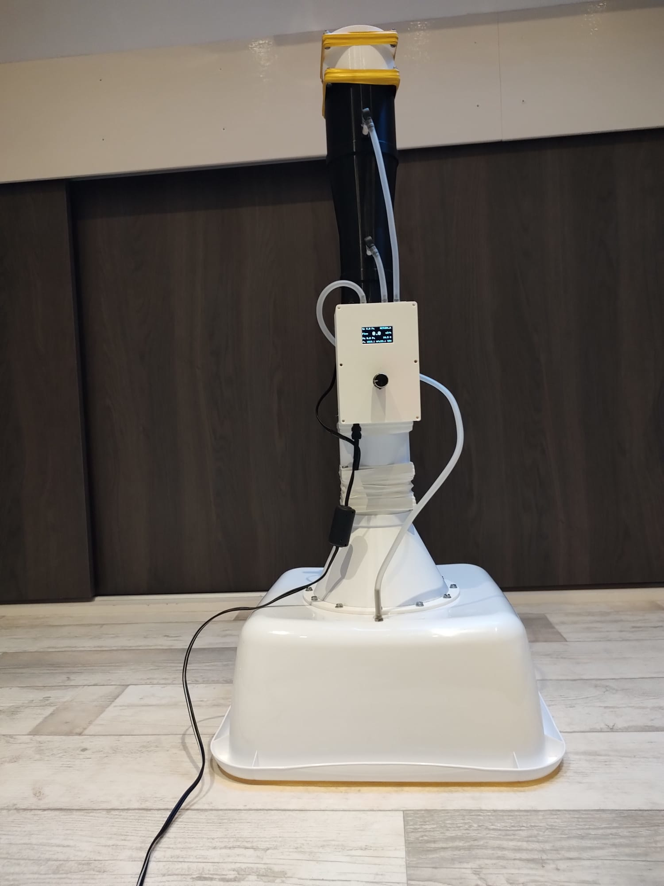

# Zero-Pressure Compensated Airflow Meter

  

An open-source, high-precision instrument designed for measuring air flow in residential ventilation systems (HRV/MVHR). By using active zero-pressure compensation, this device eliminates its own pneumatic resistance, providing "invisible" measurements that do not disturb the ventilation system's balance.

## 1. Core Principle

Traditional flow hoods create backpressure, leading to underestimated flow readings. This device uses a secondary **SDP800-500PA** differential pressure sensor to monitor the pressure inside the hood. An integrated **Arctic S8038-10K fan** is controlled via a PID loop to maintain exactly $0.0\text{ Pa}$ relative to the room.

---

## 2. Hardware Architecture

The **ESP32-WROOM** utilizes two independent I2C buses to ensure high-speed data acquisition without bus collisions between identical sensors.

### Pinout Configuration

| Component | Function | ESP32 GPIO | Notes |
| --- | --- | --- | --- |
| **I2C Bus 0** | Data / Clock | **21 / 22** | BME280, OLED, SDP800 (Venturi) |
| **I2C Bus 1** | Data / Clock | **25 / 26** | SDP800 (Zero-Pressure Sensor) |
| **Encoder** | CLK / DT / SW | **2, 4, 15** | Menu & Calibration |
| **PWM Fan** | Speed Control | **27** | 25kHz PWM signal |

---

## 3. User Interface & Menu Structure

The 1.3" OLED (SH1106) provides a high-density data overview using a context-aware interface.

### Navigation Logic

* **Short Press:** Opens the **Quick-Profile Menu** to switch between calibrated profiles (Axial/Radial - Supply/Extract).
* **Long Press (>2s):** Enters the **System Menu** (Back, Tune Zero-Comp, Tune Flow, Tune PID).

### Display Layout (Measurement Mode)

The screen is optimized for the SH110X library using `textsize 1` and `textsize 2`.

| Position | Content | Example |
| --- | --- | --- |
| **Top Left** | Active Setpoint | `Set: 1.25 Pa` |
| **Top Right** | Profile Name | `RAD-SUPPLY` |
| **Center** | **Flow Rate** | **125.4 m3/h** |
| **Row 3** | Hood P / Temp | `P: 0.1 Pa` / `21.2 C` |
| **Bottom** | Baro / Hum | `1014 hPa` / `42 %` |

---

## 4. Interactive Calibration (Live-Trim)

The device uses a "Live-Trim" methodology. Settings are automatically saved to the active profile in the **NVS Flash** memory (`Preferences.h`).

* **Tune Zero-Comp:** Adjust the setpoint (range -25 to +25 Pa) while connected to the test bench to compensate for air impingement (common in radial valves).
* **Tune Flow:** Rotate the encoder to align the meter's flow reading with the reference Test Bench.
* **Tune PID:** Select P, I, or D using **inverse video highlighting**. Adjust parameters in real-time and observe fan stability immediately.

---

## 5. Scientific Calculations

### Air Density ($\rho$)

Precision is maintained by calculating the density of moist air using the **Magnus-Tetens** approximation:

$$\rho = \frac{p_{dry}}{R_d \cdot T} + \frac{p_{vapor}}{R_v \cdot T}$$

### Volumetric Flow ($Q$)

Calculated based on the pressure differential across the Venturi throat:

$$Q = 3600 \cdot C_d \cdot A_{throat} \cdot \sqrt{\frac{2 \cdot \Delta P}{\rho \cdot (1 - \beta^4)}}$$

Which Beta ($$\beta$$) equals to:

$$\beta = \frac{D_{throat}}{D_{inlet}}$$

---

## 6. Manufacturing & Assembly

### 3D Printing

* **Material:** **PETG** (0.2mm layer height) for structural integrity and heat resistance.
* **Venturi Tube:** Printed in three sections (Inlet, Throat, Outlet) and bonded with **epoxy resin**.
* **Direct Drive:** Highly recommended to minimize stringing in PETG parts.

### Aerodynamics & Pressure Sensing

* **Dual Piezometric Rings:** The final Venturi design features integrated pressure rings at both the inlet and the throat. Each ring averages the static pressure from multiple points to ensure high accuracy.
* **Flow Hood Sensing:** The flow hood utilizes a 12-port averaging ring (2.5mm ports) to provide a stable signal for the zero-pressure logic.
* **Reversible Adapters:** Custom adapters allow the flow hood to be mounted on either side of the core assembly. This allows switching between supply and extract measurements while maintaining optimal aerodynamic orientation for the fan and Venturi.

---

## 7. License

This project is licensed under the **MIT License**.

---
